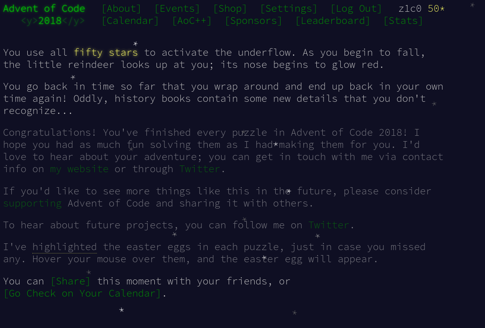
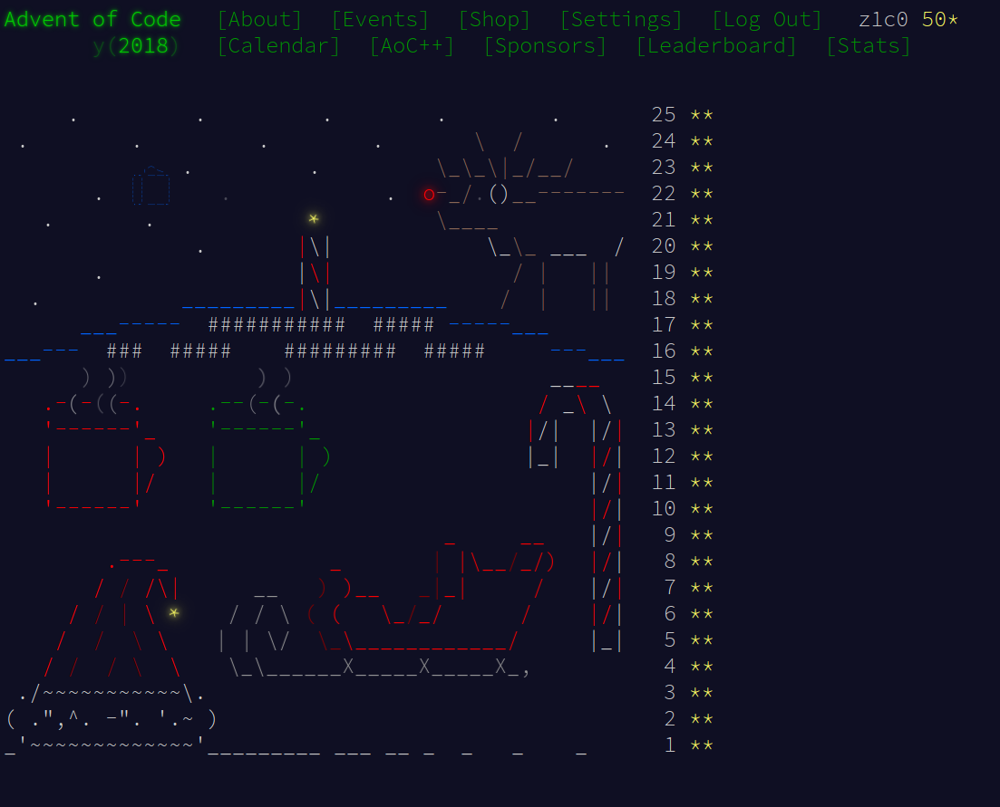

# Advent of Code 2018

https://adventofcode.com/2017





## Day15

This was quite a head-scratcher and I don't know how many hours I wasted on this one.
In the end, it was just a small stupid mistake that I corrected while refactoring that
puzzle.

```text
Elf AttackPower: 25

################################
#...############################
###..###########################
##.....#########################
#......#########################
##......########################
#.......########################
###....#########################
###....#########################
######...#######################
#######E.E.##################### E (200) E (125)
###..#..EE.E..........########## E (182) E (182) E (95)
##...E...E....#####...##.####### E (107) E (62)
#.......E....#######...#..###### E (200)
#...####....#########......#####
#...##.#....#########.......####
#...##......#########.........##
#...##......#########.......####
#.........E.#########.......#### E (182)
#............#######...........#
#.............#####............#
#............E...............### E (200)
#................#####.#..######
#..#..............####...#######
#..#..............######.#######
####.#...........###############
########..##...#################
##...##..###..##################
#.......########################
##......########################
###......#######################
################################

Combat ends after 35 full rounds.
10 elves.
Outcome: 35 * 1535 = 53725
```

## Day18

Part 2 was one of those "your assembly code does not terminate in endless
time" problems, which I both enjoy and hate because of the amount of time
it takes me to "decompile" and fully understand those instructions.
This time I had the idea to create a helper method that rewrites
(`Rewrite()`) the low-level instructions to (slightly) more readable
code that I then manually decompile further. This saved me a bit of time
(and mistakes) I think.

For example:

* `Addi 1 1 1` beomes `b = b + 1;`
* `eqrr 5 2 5` becomes `f = f == c ? 1 : 0;`

(The variables `a` to `f` represent the registers from `0` to `5` here.)

## Day21

The **code decompilation** helper from **Day 18** came in handy here again and
made this puzzle trivial to solve.

## Day23

Part 2 of this puzzle was quite annoying. I tried a couple of approaches (e.g. line
sweep) but to no avail. So I simply manually **binary-searched**
my way into the solution. I haven't looked for a more algorithmic solution yet,
being optimistic and thinking that I might revisit this one day. Let's see ;-)
